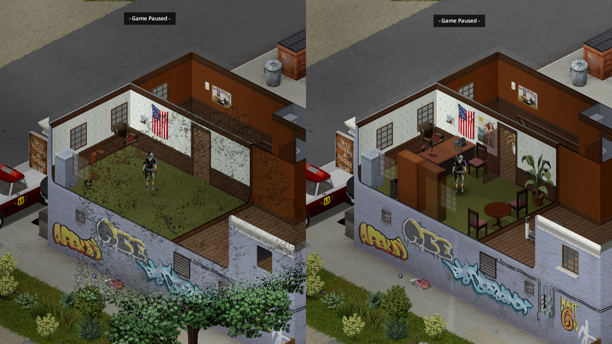

# Clear Canopy

A single-purpose fix mod for Project Zomboid B42 (42.20+).



Since 42.20, the map uses giant jumbo trees (up to JUMBOXXL, 16 tiles
tall on screen). When one of them stands next to a building, its crown
covers the rooms from the outside: standing indoors behind the crown,
the interior becomes hard to read, and on upper floors it can disappear
behind the foliage entirely, with patchy tree outlines drawn over the
room.

Clear Canopy hides a jumbo tree while you are indoors and its sprite
covers your character's position on screen. Step outside, or move out
from behind the crown, and the tree renders normally again. No options,
no keybinds — subscribe and forget.

This is meant as a stopgap: once the vanilla bug is fixed, unsubscribe
and nothing is left behind.

## Requirements

- Project Zomboid B42, 42.20 or later
- [ZombieBuddy](https://steamcommunity.com/sharedfiles/filedetails/?id=3619862853)
  (Java bytecode patching framework, one-time setup)

## How it works

A ZombieBuddy `@Patch` on `IsoTree.render` skips rendering when three
conditions meet: the camera player's square is inside a room, the tree's
sprite name is a `JUMBO` variant, and the sprite's screen bounding box
(crown included, derived from the `FBORenderChunk` jumbo dimensions)
covers the player's screen position plus a one-tile margin.

## Building

```bash
cp build.local.example build.local   # then edit paths
bash build.sh
```

Compiles against your PZ install's `projectzomboid.jar` and
`ZombieBuddy.jar`, packages `clearcanopy.jar`, and installs the mod to
`~/Zomboid/mods/ClearCanopy`.

## License

MIT — see [LICENSE](LICENSE).
